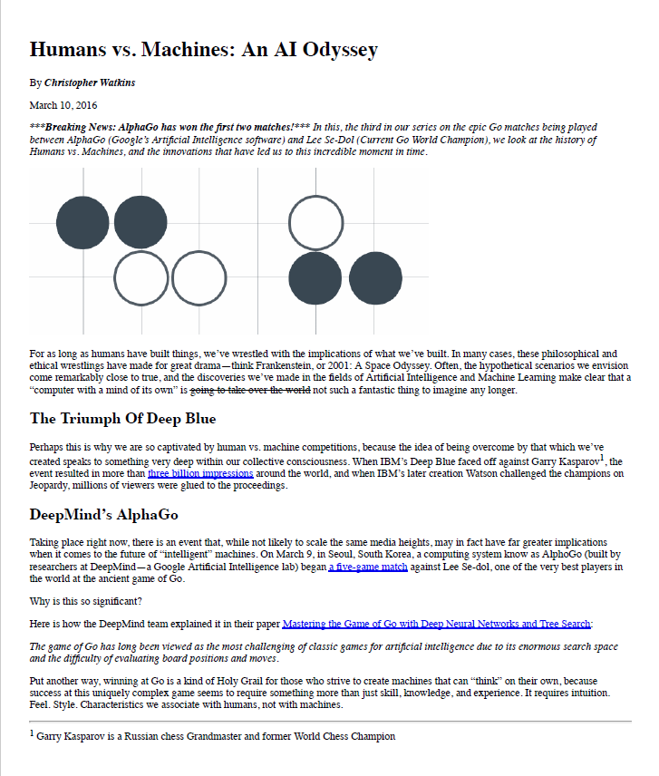

# Conversão de Mockup para HTML sem CSS
## Projeto Mockup Simples

1. Conversão de um protótipo de design (imagem) em uma página web, utilizando apenas HTML, sem CSS.
2. Este projeto foi concluído com sucesso como uma das tarefas para concluir o curso da especialização Frontend Developer Nanodegree da [Udacity] (https://br.udacity.com).

### Preview:

## O mockup está na forma de um arquivo pdf e tem a sua aparência na seguinte forma:

Mockup

